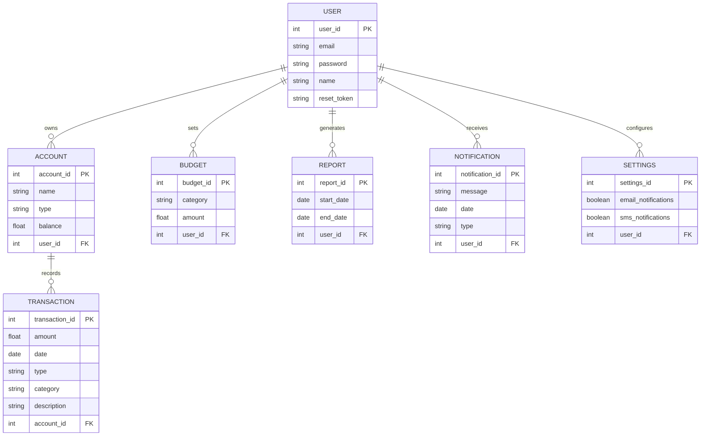

# Requirement Definition for Personal Finance Management App

## Functionality

### User Management
- **User Registration and Login:**
  - Allow users to create an account using email and password.
  - Implement login functionality with the ability to reset passwords.

### Dashboard
- **Overview:**
  - Provide a summary view of the user's financial status, including total income, total expenses, and balance.
  - Display recent transactions.

### Accounts Management
- **Account Types:**
  - Allow users to add multiple account types (e.g., bank accounts, credit cards, cash).
  - Enable users to name and categorize their accounts.
- **Account Overview:**
  - Display balance for each account.

### Transaction Management
- **Add Transactions:**
  - Allow users to manually add transactions (income or expense).
  - Enable categorization of transactions (e.g., food, rent, entertainment).
  - Provide fields for amount, date, account, category, and description.
- **Edit/Delete Transactions:**
  - Allow users to edit or delete existing transactions.

### Budget Management
- **Set Budgets:**
  - Enable users to set monthly budgets for different categories (e.g., groceries, utilities).
- **Track Budgets:**
  - Display budget utilization (amount spent vs. budget limit) for each category.

### Reporting
- **Basic Reports:**
  - Provide a summary report of income and expenses by category.
  - Allow users to view reports for different time periods (e.g., weekly, monthly, yearly).

### Notifications
- **Alerts and Reminders:**
  - Notify users of budget limits reached.
  - Send reminders for upcoming bills or financial obligations.

### Settings
- **Profile Management:**
  - Allow users to update personal information and change passwords.
- **App Preferences:**
  - Enable users to customize app settings, such as notification preferences.


## Entity Definitions

### USER
- **user_id**: Unique identifier for the user (Primary Key).
- **email**: Email address of the user.
- **password**: Password for user authentication.
- **name**: Name of the user.
- **reset_token**: Token used for password reset.

### ACCOUNT
- **account_id**: Unique identifier for the account (Primary Key).
- **name**: Name of the account.
- **type**: Type of the account (e.g., bank account, credit card, cash).
- **balance**: Current balance of the account.
- **user_id**: Identifier of the user who owns the account (Foreign Key).

### TRANSACTION
- **transaction_id**: Unique identifier for the transaction (Primary Key).
- **amount**: Amount of the transaction.
- **date**: Date of the transaction.
- **type**: Type of transaction (income or expense).
- **category**: Category of the transaction (e.g., food, rent, entertainment).
- **description**: Description of the transaction.
- **account_id**: Identifier of the account associated with the transaction (Foreign Key).

### BUDGET
- **budget_id**: Unique identifier for the budget (Primary Key).
- **category**: Category for which the budget is set.
- **amount**: Amount allocated for the budget.
- **user_id**: Identifier of the user who sets the budget (Foreign Key).

### REPORT
- **report_id**: Unique identifier for the report (Primary Key).
- **start_date**: Start date of the report period.
- **end_date**: End date of the report period.
- **user_id**: Identifier of the user who generates the report (Foreign Key).

### NOTIFICATION
- **notification_id**: Unique identifier for the notification (Primary Key).
- **message**: Notification message.
- **date**: Date of the notification.
- **type**: Type of notification (e.g., alert, reminder).
- **user_id**: Identifier of the user who receives the notification (Foreign Key).

### SETTINGS
- **settings_id**: Unique identifier for the settings (Primary Key).
- **email_notifications**: Preference for email notifications.
- **sms_notifications**: Preference for SMS notifications.
- **user_id**: Identifier of the user who configures the settings (Foreign Key).



## API Endpoints

### User Management

#### Register a new user
- **Endpoint:** `POST /api/users/register`
- **Request Body:**
  ```json
  {
    "email": "user@example.com",
    "password": "password123",
    "name": "User Name"
  }
  ```

#### Login a user
- **Endpoint:** `POST /api/users/login`
- **Request Body:**
  ```json
  {
    "email": "user@example.com",
    "password": "password123"
  }
  ```

#### Reset password
- **Endpoint:** `POST /api/users/reset-password`
- **Request Body:**
  ```json
  {
    "email": "user@example.com"
  }
  ```

### Dashboard

#### Get dashboard overview
- **Endpoint:** `GET /api/dashboard`
- **Response:**
  ```json
  {
    "total_income": 1000,
    "total_expenses": 500,
    "balance": 500,
    "recent_transactions": [...]
  }
  ```

### Accounts Management

#### Add a new account
- **Endpoint:** `POST /api/accounts`
- **Request Body:**
  ```json
  {
    "name": "Savings Account",
    "type": "bank account",
    "balance": 1000
  }
  ```

#### Get all accounts
- **Endpoint:** `GET /api/accounts`
- **Response:**
  ```json
  [
    {
      "account_id": 1,
      "name": "Savings Account",
      "type": "bank account",
      "balance": 1000
    },
    ...
  ]
  ```

#### Update an account
- **Endpoint:** `PUT /api/accounts/{account_id}`
- **Request Body:**
  ```json
  {
    "name": "Updated Account Name",
    "type": "credit card",
    "balance": 1500
  }
  ```

#### Delete an account
- **Endpoint:** `DELETE /api/accounts/{account_id}`

### Transaction Management

#### Add a transaction
- **Endpoint:** `POST /api/transactions`
- **Request Body:**
  ```json
  {
    "amount": 100,
    "date": "2023-01-01",
    "type": "expense",
    "category": "food",
    "description": "Grocery shopping",
    "account_id": 1
  }
  ```

#### Get transactions
- **Endpoint:** `GET /api/transactions`
- **Response:**
  ```json
  [
    {
      "transaction_id": 1,
      "amount": 100,
      "date": "2023-01-01",
      "type": "expense",
      "category": "food",
      "description": "Grocery shopping",
      "account_id": 1
    },
    ...
  ]
  ```

#### Update a transaction
- **Endpoint:** `PUT /api/transactions/{transaction_id}`
- **Request Body:**
  ```json
  {
    "amount": 150,
    "date": "2023-01-01",
    "type": "expense",
    "category": "food",
    "description": "Grocery shopping updated",
    "account_id": 1
  }
  ```

#### Delete a transaction
- **Endpoint:** `DELETE /api/transactions/{transaction_id}`

### Budget Management

#### Set a budget
- **Endpoint:** `POST /api/budgets`
- **Request Body:**
  ```json
  {
    "category": "groceries",
    "amount": 300
  }
  ```

#### Get budgets
- **Endpoint:** `GET /api/budgets`
- **Response:**
  ```json
  [
    {
      "budget_id": 1,
      "category": "groceries",
      "amount": 300
    },
    ...
  ]
  ```

#### Update a budget
- **Endpoint:** `PUT /api/budgets/{budget_id}`
- **Request Body:**
  ```json
  {
    "category": "groceries",
    "amount": 350
  }
  ```

#### Delete a budget
- **Endpoint:** `DELETE /api/budgets/{budget_id}`

### Reporting

#### Generate a report
- **Endpoint:** `POST /api/reports`
- **Request Body:**
  ```json
  {
    "start_date": "2023-01-01",
    "end_date": "2023-01-31"
  }
  ```
- **Response:**
  ```json
  {
    "report_id": 1,
    "start_date": "2023-01-01",
    "end_date": "2023-01-31",
    "data": {
      "income": [...],
      "expenses": [...]
    }
  }
  ```

#### Get reports
- **Endpoint:** `GET /api/reports`
- **Response:**
  ```json
  [
    {
      "report_id": 1,
      "start_date": "2023-01-01",
      "end_date": "2023-01-31"
    },
    ...
  ]
  ```

### Notifications

#### Get notifications
- **Endpoint:** `GET /api/notifications`
- **Response:**
  ```json
  [
    {
      "notification_id": 1,
      "message": "Budget limit reached for groceries",
      "date": "2023-01-15",
      "type": "alert"
    },
    ...
  ]
  ```

#### Delete a notification
- **Endpoint:** `DELETE /api/notifications/{notification_id}`

### Settings

#### Get user settings
- **Endpoint:** `GET /api/settings`
- **Response:**
  ```json
  {
    "settings_id": 1,
    "email_notifications": true,
    "sms_notifications": false
  }
  ```

#### Update user settings
- **Endpoint:** `PUT /api/settings`
- **Request Body:**
  ```json
  {
    "email_notifications": true,
    "sms_notifications": true
  }
  ```
