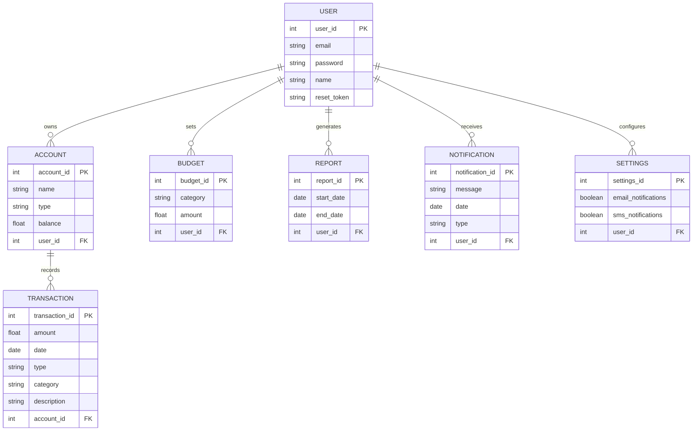

# Requirement Definition for Personal Finance Management App

## Functionality

### User Management
- **User Registration and Login:**
  - Allow users to create an account using email and password.
  - Implement login functionality with the ability to reset passwords.

### Dashboard
- **Overview:**
  - Provide a summary view of the user's financial status, including total income, total expenses, and balance.
  - Display recent transactions.

### Accounts Management
- **Account Types:**
  - Allow users to add multiple account types (e.g., bank accounts, credit cards, cash).
  - Enable users to name and categorize their accounts.
- **Account Overview:**
  - Display balance for each account.

### Transaction Management
- **Add Transactions:**
  - Allow users to manually add transactions (income or expense).
  - Enable categorization of transactions (e.g., food, rent, entertainment).
  - Provide fields for amount, date, account, category, and description.
- **Edit/Delete Transactions:**
  - Allow users to edit or delete existing transactions.

### Budget Management
- **Set Budgets:**
  - Enable users to set monthly budgets for different categories (e.g., groceries, utilities).
- **Track Budgets:**
  - Display budget utilization (amount spent vs. budget limit) for each category.

### Reporting
- **Basic Reports:**
  - Provide a summary report of income and expenses by category.
  - Allow users to view reports for different time periods (e.g., weekly, monthly, yearly).

### Notifications
- **Alerts and Reminders:**
  - Notify users of budget limits reached.
  - Send reminders for upcoming bills or financial obligations.

### Settings
- **Profile Management:**
  - Allow users to update personal information and change passwords.
- **App Preferences:**
  - Enable users to customize app settings, such as notification preferences.

## Entity Definitions

### USER
- **user_id**: Unique identifier for the user (Primary Key).
- **email**: Email address of the user.
- **password**: Password for user authentication.
- **name**: Name of the user.
- **reset_token**: Token used for password reset.

### ACCOUNT
- **account_id**: Unique identifier for the account (Primary Key).
- **name**: Name of the account.
- **type**: Type of the account (e.g., bank account, credit card, cash).
- **balance**: Current balance of the account.
- **user_id**: Identifier of the user who owns the account (Foreign Key).

### TRANSACTION
- **transaction_id**: Unique identifier for the transaction (Primary Key).
- **amount**: Amount of the transaction.
- **date**: Date of the transaction.
- **type**: Type of transaction (income or expense).
- **category**: Category of the transaction (e.g., food, rent, entertainment).
- **description**: Description of the transaction.
- **account_id**: Identifier of the account associated with the transaction (Foreign Key).

### BUDGET
- **budget_id**: Unique identifier for the budget (Primary Key).
- **category**: Category for which the budget is set.
- **amount**: Amount allocated for the budget.
- **user_id**: Identifier of the user who sets the budget (Foreign Key).

### REPORT
- **report_id**: Unique identifier for the report (Primary Key).
- **start_date**: Start date of the report period.
- **end_date**: End date of the report period.
- **user_id**: Identifier of the user who generates the report (Foreign Key).

### NOTIFICATION
- **notification_id**: Unique identifier for the notification (Primary Key).
- **message**: Notification message.
- **date**: Date of the notification.
- **type**: Type of notification (e.g., alert, reminder).
- **user_id**: Identifier of the user who receives the notification (Foreign Key).

### SETTINGS
- **settings_id**: Unique identifier for the settings (Primary Key).
- **email_notifications**: Preference for email notifications.
- **sms_notifications**: Preference for SMS notifications.
- **user_id**: Identifier of the user who configures the settings (Foreign Key).

